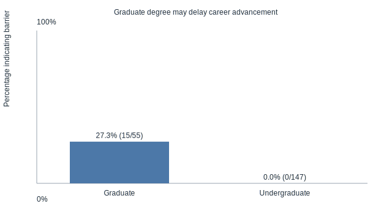

# Perceived CPA Licensure Barriers by Respondent Group

Grouping question: **Are you currently an undergraduate student or graduate student?**

## Barrier indicators

| Barrier | Group | Respondents | Percentage |
| --- | --- | ---: | ---: |
| Graduate degree may delay career advancement | Graduate | 15 / 55 | 27.3% |
| Graduate degree may delay career advancement | Undergraduate | 0 / 147 | 0.0% |

## Summary

* Graduate respondents were more likely to report the barrier "Graduate degree may delay career advancement" than Undergraduate respondents (27.3% vs. 0.0%, a 27.3 percentage point gap).

## Chart

## Notes

* The dataset contains one Likert-style barrier statement with negative phrasing that aligns to a perceived barrier. The analysis above is limited to that item.